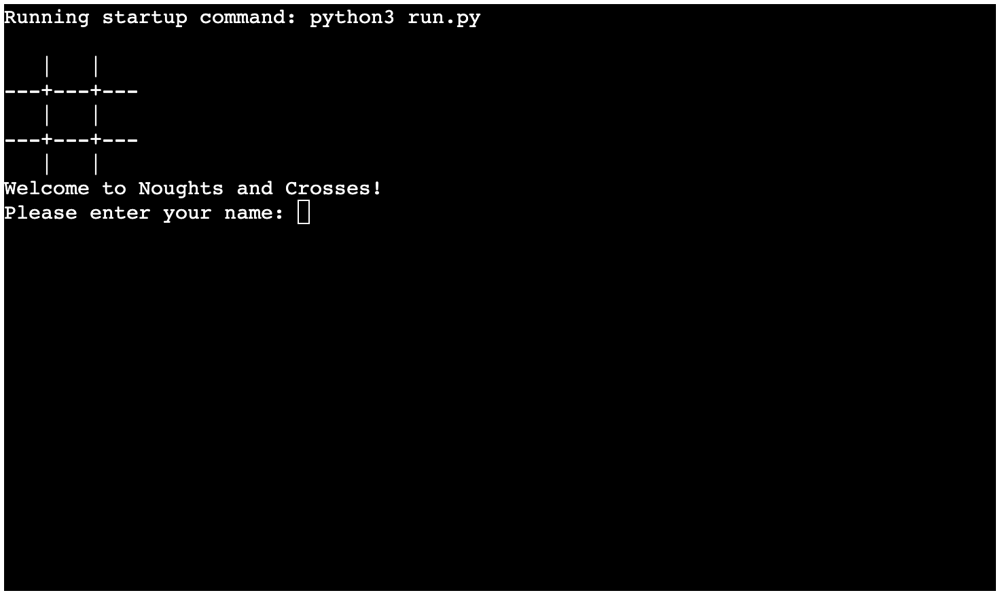
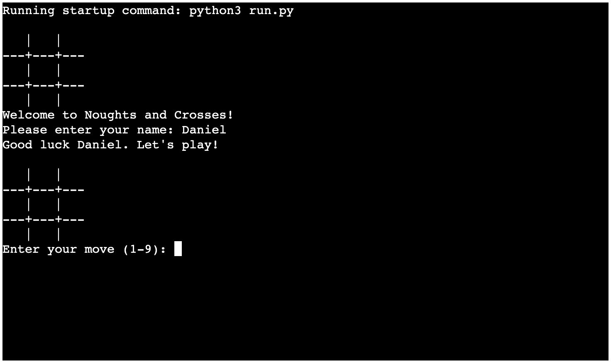
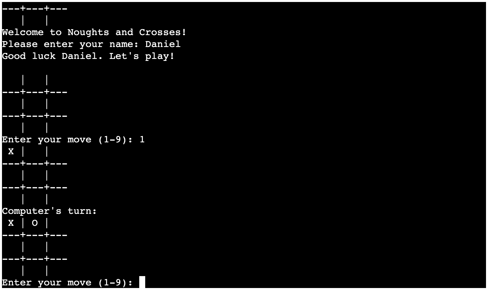
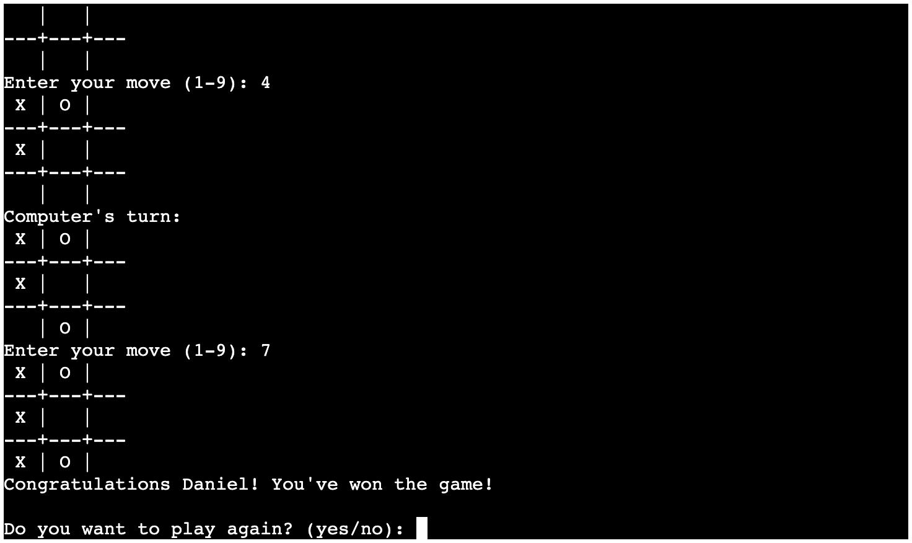
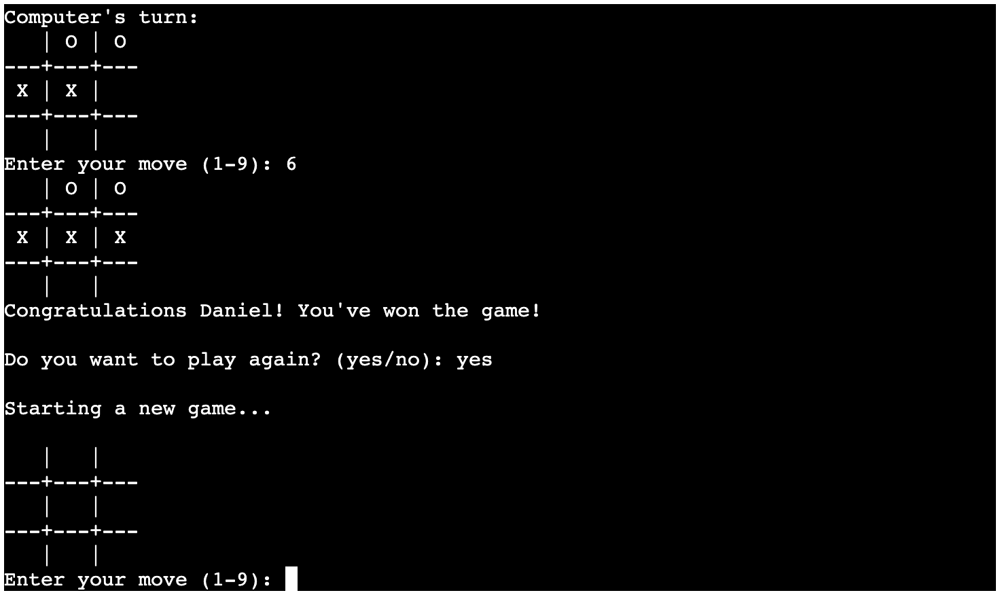
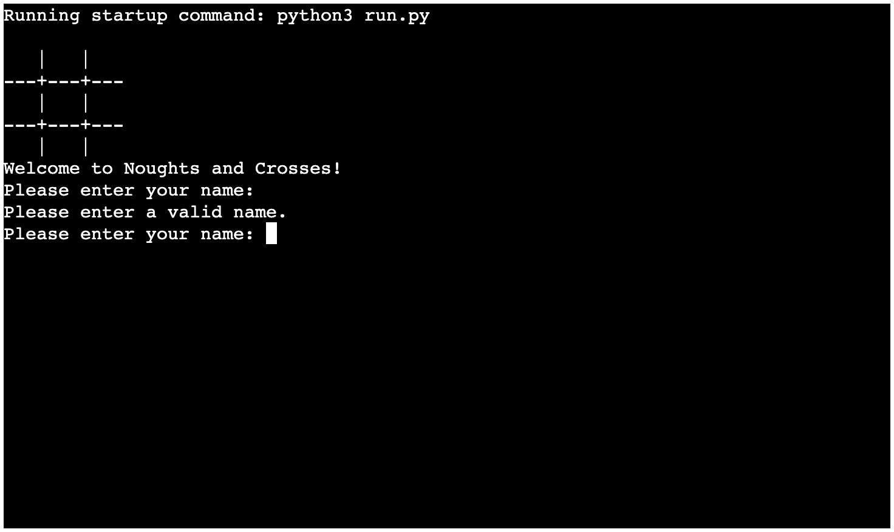
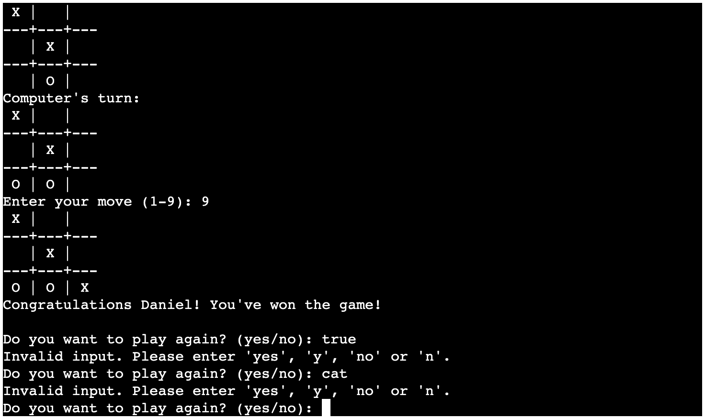
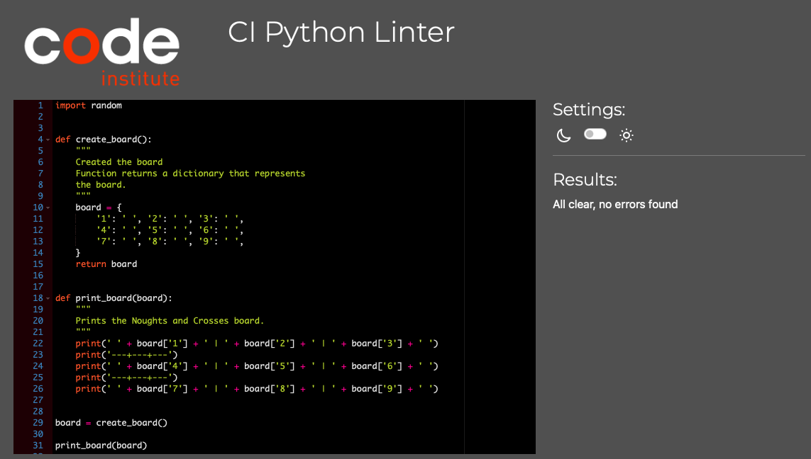

# Noughts and Crosses

Noughts and Crosses is a Python terminal game, which runs in the Code Institute mock terminal on Heroku.

Noughts and Crosses (or tic-tac-toe in American English) is traditionally a paper-and-pencil game for 2 players who take turns marking the spaces in a 3x3 grid with an O or X (Noughts or Crosses).

The player who succeeds in placing 3 of their marks in a row (horizontally, vertically or diagonally) is the winner. It is a solved game, with a forced draw assuming best play from both players. You can read more about it on [Wikipedia](https://en.wikipedia.org/wiki/Tic-tac-toe)

## Table of Content

+ UX
    + Site Purpose
    + User Demographic
    + User Goals
        + First time player
        + Frequent player
+ Design
+ Features
    + Existing Features
        + Landing screen
        + Game start
        + First move
        + Completed game
        + New game
        + Name validation
        + Move validation
        + Game validation
    + Features left to implement
+ Technologies Used
    + Main Languages Used
    + Frameworks, Libraries & Programs
+ Testing
    + App Testing
        + Terminal compatibility
        + Application features
        + Validation
        + Conclusion    
    + Validator Testing
    + Bugs
    + Unfixed Bugs
+ Deployment
+ Credits

## UX

### Site Purpose

To allow players to participate in a quick, enjoyable game against an AI opponent.

### User Demographics

Anyone that is interested in playing the game.

### User Goals

#### First time player

- As a first time player, I want to learn more about the game.
- As a first time player, I want to improve my knowledge of basic strategy.
- As a first time player, I want to be guided on how to play the game.
- As a first time player, I want to input my name and receive customised messages.
- As a first time player, I want to exit the game upon completion.
- As a first time player, I want the opportunity to play again without restarting the App.

#### Frequent player

- As a frequent player, I want to keep playing to increase my knowledge.
- As a frequent player, I want to be tested by the AI to improve my ability.
- As a frequent player, I want to see how I am getting on vs the AI.
- As a frequent player, I want to test my ability against another Human player.

## Features

### Existing Features

#### Landing screen:

#### Game start:

#### First move:

#### Completed game:

#### New game:

#### Name validation:

#### Move validation:

#### Game validation:

### Features left to implement:

- Randomise starting order - Switching between the player and the computer would improve the user experience/difficulty.

- Increase AI intelligence - Code the AI to have some knowledge of basic strategy.

- Difficulty levels - Linked to AI knowing basic strategy, it would be fantastic to offer different difficulty levels to the player. This would increase their experience whilst allowing them to improve their ability.

- Record the score - Letting the player keep track of the score would help with immersion.

- Ability to play with 2 user players - Allowing multiple players to participate would add depth to the game and increase user adoption.

## Technologies Used

### Main Languages Used:

- Python

### Frameworks, Libraries & Programs:

- GitPod
- GitHub
- Heroku

## Testing

#### Terminal compatibility:

I tested the App in the IDE and on the deployed App’s terminal.
Confirmed that the App worked as expected.

#### Application features:

I tested all features, including entering the inputs.
Confirmed that the App worked as expected without any errors.

#### Validation:

I tested the incorrect input and associated error messages.
Confirmed that the appropriate error messages displayed when invalid data was entered.

#### Conclusion:

The testing confirmed that the Noughts and Crosses game functions as expected, providing a simple, enjoyable experience to the player.

### Validator Testing

- run.py passes through the [CI Python Linter](https://pep8ci.herokuapp.com) with no issues found.

### Bugs

- Players were able to enter a space as their name. Resolved by adding the .strip() function.

### Unfixed Bugs

- There are no unfixed bugs.

## Deployment

The App was deployed via Heroku. The steps to do so are as follows:

1. Create an account with Heroku
2. Click “new” to create a new App from the dashboard
3. Enter a unique App name
4. Select region
5. Click “Create App”
6. Navigate to the “Settings” tab
7. Scroll down to Config Vars and click “Reveal Config Vars”
8. Enter “Port” as the key and “8000” as the value.
9. Click Add
10. Navigate to Buildpacks and click “Add buildpack”
11. Add Python into the Buildpack
12. Add NodeJS into the Buildpack
13. Navigate to the “Deploy” tab
14. Select GitHub as the Deployment method
15. Search for repository name
16. Select Branch to build from
17. Connect via the “Connect” button
18. Choose either “Automatic” or “Manual”. (I chose Manual)
19. Build App
20. Once completed, click “View” to visit the deployed App

## Credits

- I would like to thank my mentor Martina Terlovic for her assistance and support throughout the project.
- Advice on how to draw the board was taken from [Reddit](https://www.reddit.com/r/learnpython/comments/l97our/drawing_a_tictactoe_game_board/?rdt=50795)